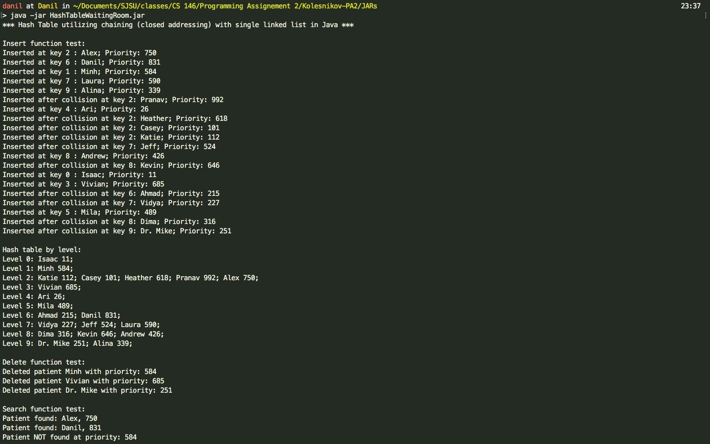

# Hash Table (Closed Addressing) 
> Java implementation of a Hash Table data structure utilizing chaining(closed addressing) with a single linked list as its colission resolution.



# Description
* Hash Table size: 11.
* Hash function: division (x mod 11) 
* Functions implemented: insert, delete, search, print by level.
* To be implemented: Max, Min.

## Usage

Terminal:

```sh
cd out/artifacts/HashTableWaitingRoom_jar
java -jar HashTableWaitingRoom.jar
```
## Meta

Danil Kolesnikov – danil.kolesnikov@sjsu.edu

Distributed under the MIT license.
